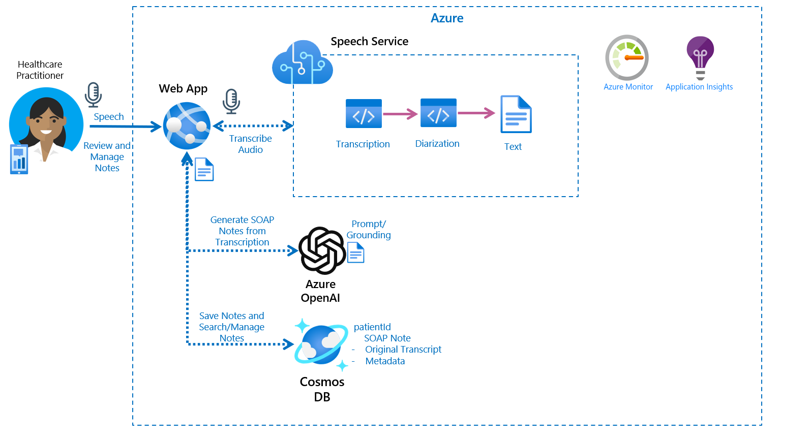
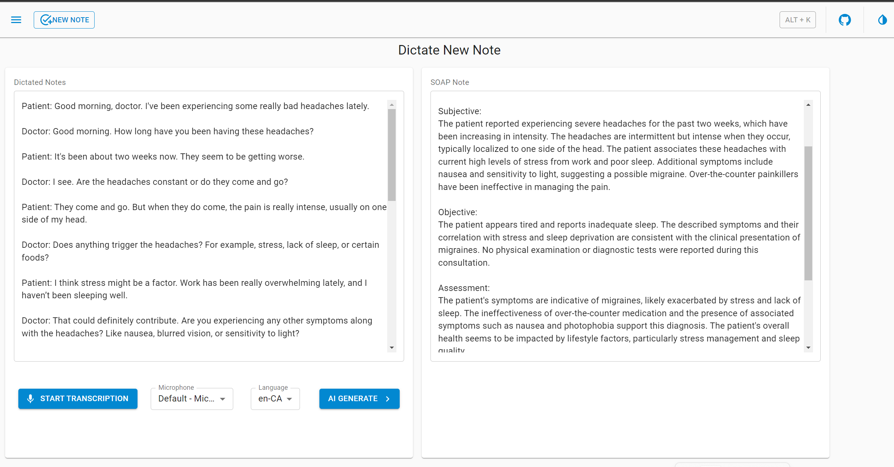

# GenAI for transcriptions

Dictate, Transcribe and Summarize as SOAP Notes


## Architecture



# UI



## Deploy

## Prerequisites

- [Azure CLI](https://docs.microsoft.com/en-us/cli/azure/install-azure-cli)
- [Azure Developer CLI (azd)](https://learn.microsoft.com/en-us/azure/developer/azure-developer-cli/install-azd)
- [Terraform](https://learn.hashicorp.com/tutorials/terraform/install-cli)
- [Node.js](https://nodejs.org/en/download/) 
- [Python](https://python.org/) 

## Deployment Process

### Initialize Azure Developer CLI (azd)

Changed scripts to install into existing Azure RG

```
export AZURE_RESOURCE_GROUP=<name of RG>
```


```
azd init
```
### Provision Azure Resources


Verify RG in `.azure/<env>/.env

```
azd provision
```

### Deploy the Application

```
azd deploy
```
